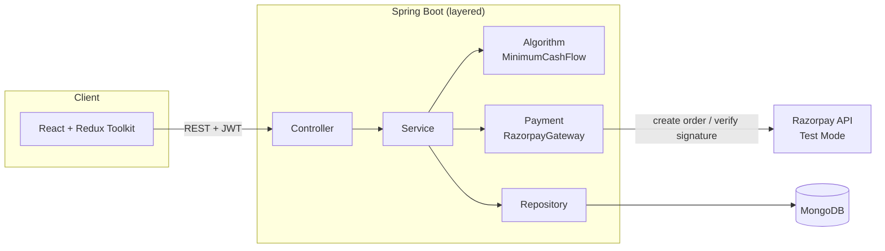
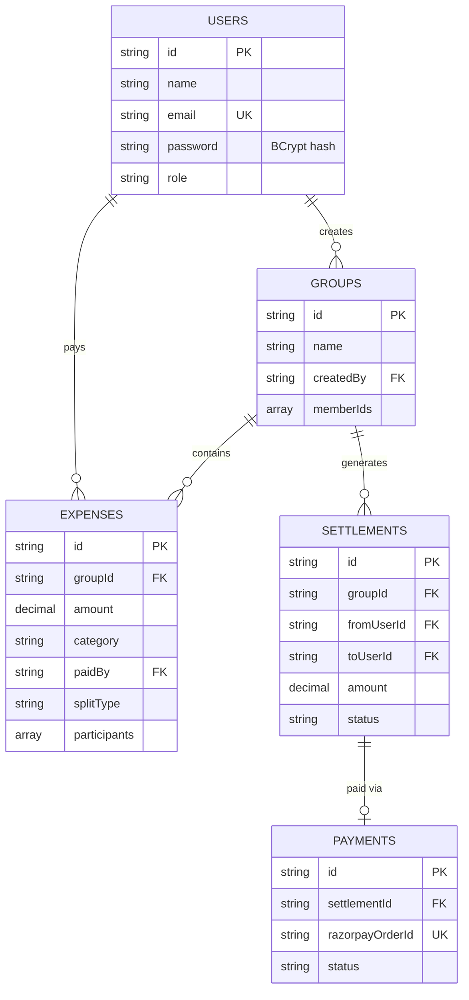
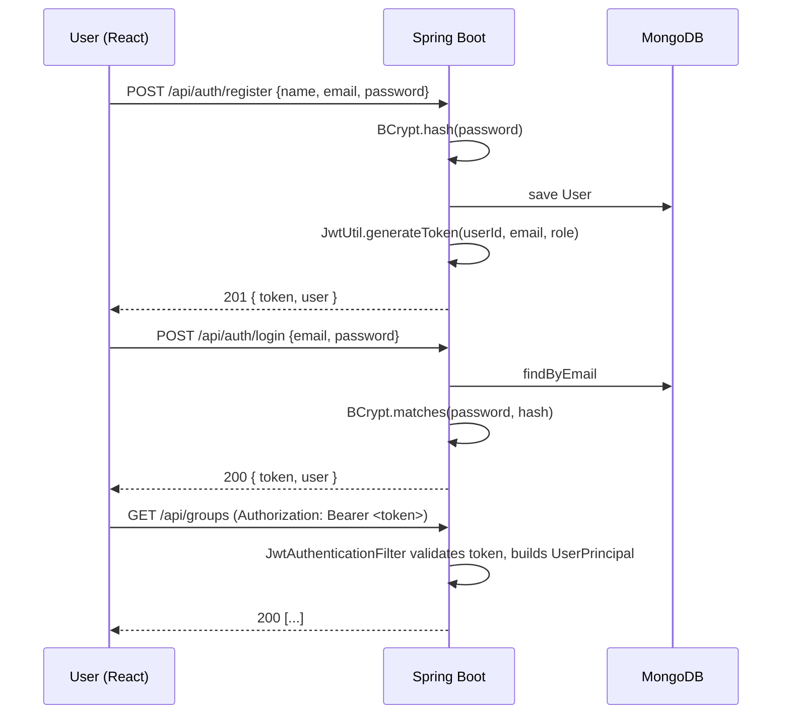
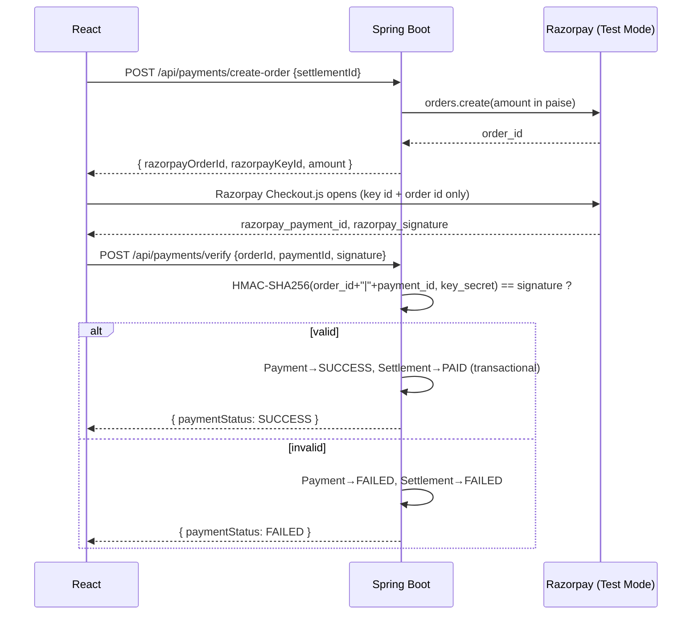

# SplitPay — Smart Split-Bill & UPI Settlement Platform

A full-stack expense-splitting app (Java/Spring Boot + MongoDB + React) inspired
by apps like Splitwise, with an original architecture and UI. It tracks group
expenses, computes who-owes-whom, collapses debts into a minimal settlement
plan using a greedy min-cash-flow algorithm, and lets people settle up over
UPI via **Razorpay Test Mode**.

> **Honesty note (read this first):** Every feature described below is
> actually implemented in this repo — nothing here is aspirational. The one
> thing that is explicitly **not** real is payment processing: Razorpay is
> wired up correctly but only against **test-mode keys**. No live money ever
> moves. See [Razorpay Payment Flow](#razorpay-payment-flow--test-mode-only)
> for what that does and doesn't mean.

---

## Table of contents

- [Features](#features)
- [Technology stack](#technology-stack)
- [System architecture](#system-architecture)
- [Folder structure](#folder-structure)
- [MongoDB data model](#mongodb-data-model)
- [Authentication flow](#authentication-flow)
- [Expense splitting logic](#expense-splitting-logic)
- [Balance calculation](#balance-calculation)
- [Minimum Cash Flow algorithm](#minimum-cash-flow-algorithm)
- [Razorpay payment flow (TEST MODE ONLY)](#razorpay-payment-flow--test-mode-only)
- [Security](#security)
- [Validation](#validation)
- [Exception handling](#exception-handling)
- [Testing](#testing)
- [Setup — MongoDB](#setup--mongodb)
- [Setup — Backend](#setup--backend)
- [Setup — Frontend](#setup--frontend)
- [Environment variables](#environment-variables)
- [How to run](#how-to-run)
- [Postman collection](#postman-collection)
- [Sample data](#sample-data)
- [Sample credentials](#sample-credentials)
- [Future improvements](#future-improvements)

---

## Features

- Register / login with JWT + BCrypt
- Create groups, add/remove members
- Add expenses split **EQUAL**, **EXACT**, or **PERCENTAGE** — validated
  authoritatively on the backend, never trusted from the frontend
- Per-member balance calculation (paid vs. owed vs. net)
- **Minimum Cash Flow** settlement plan via a greedy graph algorithm
  (Java `PriorityQueue`-based)
- Settlement records with PENDING / PAID / FAILED status
- Pay a settlement through **Razorpay Checkout (Test Mode)**, with signature
  verification done server-side and idempotent payment handling
- Expense history, category/monthly/group spending charts
- Profile management, password change
- Admin dashboard (users, groups, transactions, payment-status summary)

## Technology stack

**Backend:** Java 17, Spring Boot 3, Spring Web, Spring Data MongoDB, Spring
Security, JWT (JJWT), BCrypt, Jakarta Bean Validation, Lombok, Maven, Razorpay
Java SDK, JUnit 5, Mockito.

**Frontend:** React 18, React Router 6, Redux Toolkit, Axios, Chart.js
(`react-chartjs-2`), Vite, plain CSS (no UI kit — a custom dark FinTech-style
design system).

**Database:** MongoDB (`MongoRepository` / `@Document` — no JPA/Hibernate/
MySQL anywhere in this codebase, by design).

**Payments:** Razorpay Test/Sandbox Mode, Razorpay Checkout.js on the
frontend, `razorpay-java` SDK on the backend.

## System architecture



Standard layered flow for every request: **Controller → Service → Repository
→ MongoDB**. DTOs sit between the API and persistence layers — MongoDB
documents are never exposed directly over REST.

## Folder structure

```
SplitPay/
├── backend/
│   ├── pom.xml
│   └── src/main/java/com/splitpay/
│       ├── config/        # Security, CORS, Mongo auditing, Mongo transactions
│       ├── controller/    # REST controllers
│       ├── dto/            # request/ and response/ DTOs
│       ├── document/       # MongoDB @Document classes + enums
│       ├── repository/     # MongoRepository interfaces
│       ├── service/        # business logic
│       ├── algorithm/      # MinimumCashFlowAlgorithm (graph + greedy + PQ)
│       ├── security/       # JWT util, filter, principal
│       ├── payment/        # RazorpayGateway wrapper
│       ├── exception/      # custom exceptions + GlobalExceptionHandler
│       └── util/
├── frontend/
│   └── src/
│       ├── components/ pages/ layouts/ services/ store/ routes/ utils/
├── postman/SplitPay-API.postman_collection.json
├── sample-data/seed.js
├── docs/
├── .gitignore
├── .env.example
└── README.md   (this file)
```

## MongoDB data model

Collections: `users`, `groups`, `expenses`, `settlements`, `payments`,
`audit_logs`.



### Indexes

| Collection | Field | Type |
|---|---|---|
| users | email | unique |
| groups | memberIds | multikey |
| expenses | groupId | index |
| expenses | paidBy | index |
| settlements | groupId | index |
| settlements | fromUserId | index |
| settlements | toUserId | index |
| payments | razorpayOrderId | unique |

All declared via `@Indexed`/`@Indexed(unique = true)` on the `@Document`
classes in `backend/.../document/`.

## Authentication flow



The JWT carries `userId` (subject), `email`, and `role` — nothing else.
Passwords are never stored or logged in plain text. `SecurityConfig` protects
every endpoint except `/api/auth/**`, and `/api/admin/**` requires
`ROLE_ADMIN`.

## Expense splitting logic

Three split types, all validated **server-side** in `ExpenseService`
(`backend/.../service/ExpenseService.java`) — the frontend's numbers are only
for UX, never trusted:

- **EQUAL** — amount is divided evenly; any leftover paise from integer
  division is assigned to the first participant so the total always matches
  exactly.
- **EXACT** — caller supplies each participant's amount; the backend checks
  they sum to the total (within a 2-paisa rounding tolerance) and rejects the
  request otherwise.
- **PERCENTAGE** — caller supplies each participant's percentage; the backend
  checks they sum to 100 (within 0.5%) and computes amounts, with the last
  participant absorbing any rounding remainder.

Also enforced: amount > 0, payer and every participant must belong to the
group, and no duplicate participants.

## Balance calculation

```
netBalance(user) = totalPaid(user) − totalOwed(user)
```

- `netBalance > 0` → the user should **receive** money.
- `netBalance < 0` → the user **owes** money.

`GET /api/groups/{id}/balances` returns, per member: total paid, total owed,
net balance, and a status (`GETS_BACK` / `OWES` / `SETTLED`).

## Minimum Cash Flow algorithm

**Model:** every group member is a node in a directed graph; a debt "A owes B
₹500" is an edge `A → B` with weight 500.

**Algorithm** (`backend/.../algorithm/MinimumCashFlowAlgorithm.java`):

1. Compute each member's net balance.
2. Put negative balances (debtors) in one `PriorityQueue`, positive balances
   (creditors) in another.
3. Repeatedly pop the biggest debtor and biggest creditor, settle
   `min(|debt|, credit)` between them, push a settlement transaction, and put
   whichever side still has a non-zero balance back on its queue.
4. Repeat until both queues are empty.

```mermaid
flowchart TD
    A[Compute net balance per member] --> B{Split into<br/>debtors / creditors}
    B --> C[Max-heap of creditors]
    B --> D[Max-heap of debtors by |amount|]
    C --> E[Pop biggest creditor + biggest debtor]
    D --> E
    E --> F[settle = min amounts]
    F --> G[Record transaction]
    G --> H{Either side<br/>still non-zero?}
    H -- yes --> E
    H -- no --> I[Done — balances zeroed]
```

**⚠️ Honesty note (explicitly required by this project's spec):** this greedy
approach is **not proven to be the mathematically optimal minimum transaction
count** for every possible debt graph — the general "minimum number of
transactions to zero out a set of balances" problem is NP-hard (related to
subset-sum/partition). What it *does* guarantee is at most `n − 1`
transactions for `n` people with non-zero balances, which is already a large,
practical reduction versus settling every pairwise IOU individually. It's a
well-known, solid heuristic — not a proof-optimal solver — and the code and
UI both describe it that way rather than overclaiming.

**Time complexity:** let `n` = number of members with a non-zero net balance.
Building the two heaps is `O(n log n)`; each settlement round removes at
least one balance and does `O(log n)` heap work, so the full loop is
`O(n log n)` time and `O(n)` extra space.

`GET /api/groups/{id}/minimum-cash-flow` returns the raw original obligations
(for comparison), the optimized settlement list, transaction counts for
both, and the total settlement amount.

## Razorpay payment flow (TEST MODE ONLY)



- The Razorpay **key secret never leaves the backend** — only the public key
  id and order id reach React (`PaymentOrderResponse`).
- The frontend's checkout "success" callback is **never trusted alone**;
  `PaymentService.verify()` re-derives the HMAC signature server-side before
  anything is marked PAID.
- **Idempotent:** re-submitting an already-`SUCCESS` order id is a no-op that
  returns the existing result instead of double-processing the settlement.
- `Payment` + `Settlement` updates on successful verification happen inside a
  single `@Transactional` method (see [Transaction consistency](#transaction-consistency)).
- Only the settlement's debtor (`fromUserId`) can create an order or verify
  payment for it.
- **TEST MODE ONLY:** use `rzp_test_...` keys from your own Razorpay
  dashboard. No real UPI/card payment ever completes; use Razorpay's
  published test card/UPI credentials at checkout.

### Transaction consistency

`MongoTransactionConfig` registers a `MongoTransactionManager`, and
`PaymentService.verify()` is `@Transactional` so the `Payment` and
`Settlement` writes succeed or fail together. **MongoDB multi-document
transactions require a replica set** (a standalone `mongod` rejects them).
For local dev:

```bash
mongod --replSet rs0
mongosh --eval "rs.initiate()"
```

MongoDB Atlas clusters support transactions without extra setup. Not every
write in this project uses a transaction — only the payment-verification
path, where two documents must move together; everything else is a single
document write, which MongoDB already makes atomic.

## Security

JWT auth + BCrypt hashing, Spring Security role-based (`USER`/`ADMIN`) and
group-membership-based authorization, Jakarta Bean Validation on every
request DTO, explicit CORS configuration, a centralized
`GlobalExceptionHandler` returning a consistent JSON error shape, secrets
only via environment variables (never hardcoded, never committed), and
DTOs on every API response — MongoDB documents are never serialized directly.

## Validation

Enforced server-side (frontend validation exists too, but is not
authoritative): name/email/password format, group name/description length,
expense amount > 0, split-type-specific rules (see
[Expense splitting logic](#expense-splitting-logic)), participant/payer group
membership, no duplicate participants.

## Exception handling

`GlobalExceptionHandler` maps exceptions to consistent JSON:

```json
{
  "timestamp": "2026-09-12T10:15:30Z",
  "status": 400,
  "error": "VALIDATION_ERROR",
  "message": "Exact split amounts (2600) must add up to the total expense amount (3000)",
  "path": "/api/groups/g1/expenses"
}
```

Covers `400` (bad request/validation), `401` (unauthorized/bad credentials),
`403` (forbidden), `404` (not found), `409` (conflict, e.g. duplicate email),
and `500` (unexpected errors, with a generic message — internals are never
leaked to the client).

## Testing

JUnit 5 + Mockito, in `backend/src/test/java/com/splitpay/`:

- `algorithm/MinimumCashFlowAlgorithmTest` — settlement correctness,
  transaction-count bound (`≤ n − 1`), balances zero out, already-settled
  groups produce no transactions.
- `service/ExpenseServiceTest` — EQUAL/EXACT/PERCENTAGE split calculation and
  rejection of invalid splits, duplicate participants, non-members.
- `service/AuthServiceTest` — registration hashes passwords (never stores
  plain text), duplicate-email rejection, login success/failure paths, JWT
  issuance.
- `service/PaymentServiceTest` — successful verification marks
  Payment/Settlement correctly, invalid signature marks FAILED, **duplicate
  verification is idempotent**, only the debtor can verify their own payment.
- `service/BalanceServiceTest` — net balance = totalPaid − totalOwed.

Run with:

```bash
cd backend
mvn test
```

## Setup — MongoDB

1. Install MongoDB Community Server (or use MongoDB Atlas).
2. For local Razorpay-verification transactions to work, run Mongo as a
   single-node replica set (see [Transaction consistency](#transaction-consistency)
   above) — plain standalone Mongo works fine for everything else.
3. Open MongoDB Compass and connect to `mongodb://localhost:27017` to browse
   the `splitpay` database once the backend has run at least once (Spring
   Data MongoDB creates collections on first write).

## Setup — Backend

```bash
cd backend
cp src/main/resources/application.properties.example src/main/resources/application.properties
# edit application.properties: set MONGODB_URI, JWT_SECRET, RAZORPAY_KEY_ID/SECRET
mvn clean install
mvn spring-boot:run
```

Backend runs on `http://localhost:8080`.

> This project was authored in a sandboxed environment without access to
> Maven Central, so `mvn clean install` has **not** been run here — please
> run it locally first and open an issue-style note to yourself if anything
> doesn't compile. The frontend build, by contrast, **has** been verified
> (`npm run build` succeeds — see below).

## Setup — Frontend

```bash
cd frontend
cp .env.example .env
npm install
npm run dev
```

Frontend runs on `http://localhost:5173` (Vite dev server proxies `/api` to
`http://localhost:8080` — see `vite.config.js`). `npm run build` has been
verified to succeed in this repo.

## Environment variables

See `.env.example` (root), `backend/src/main/resources/application.properties.example`,
and `frontend/.env.example`. Never commit real secrets — only `.example`
files are tracked (enforced by `.gitignore`).

| Variable | Used by | Purpose |
|---|---|---|
| `MONGODB_URI` | backend | Mongo connection string |
| `JWT_SECRET` | backend | HMAC signing key for JWTs (32+ bytes) |
| `JWT_EXPIRATION_MS` | backend | Access token lifetime |
| `RAZORPAY_KEY_ID` / `RAZORPAY_KEY_SECRET` | backend | Razorpay **test** credentials |
| `CORS_ALLOWED_ORIGINS` | backend | Allowed frontend origin(s) |
| `VITE_API_BASE_URL` | frontend | Backend API base path |

## How to run

```bash
# Terminal 1
cd backend && mvn spring-boot:run

# Terminal 2
cd frontend && npm run dev
```

Then open `http://localhost:5173`, register a user, create a group, add
members by their registered email, log expenses, and generate a settlement
plan.

## Postman collection

Import `postman/SplitPay-API.postman_collection.json`. Folders: Authentication,
Users, Groups, Expenses, Balances, Minimum Cash Flow, Settlements, Payments,
Admin. Set the collection variable `token` after calling Login/Register.

## Sample data

`sample-data/seed.js` seeds 5 users, 2 groups, expenses across all three
split types, one pending and one paid settlement, with realistic Indian
names and INR amounts:

```bash
mongosh "mongodb://localhost:27017/splitpay" sample-data/seed.js
```

**Read the comment at the top of that file** — the seeded password hash is a
placeholder and must be swapped for a real BCrypt hash (easiest: register one
throwaway user through the running API and copy its `password` field) before
seeded logins will actually work.

## Sample credentials

None are pre-baked and valid out of the box — see the note above. Register
your own account via `/api/auth/register`, or fix up the seed script's hash
first.

## Future improvements

- Refresh tokens (the `refresh_tokens` collection is scaffolded but not
  wired up — access tokens currently just expire)
- Recurring/split-by-item expenses
- Push notifications for new expenses and settlement requests
- Multi-currency support
- Group-level expense export (CSV/PDF)
- Rate limiting on auth endpoints
